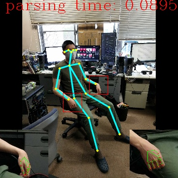
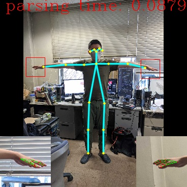
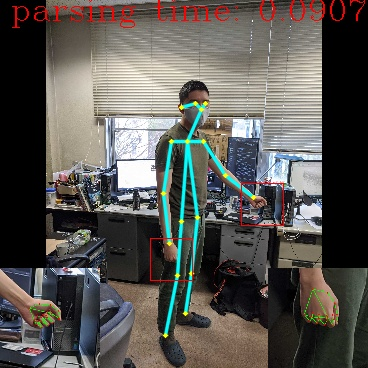
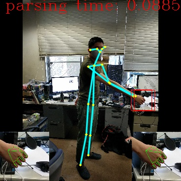
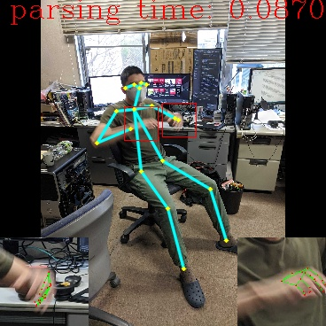

Hand and body pose
========
-----
# 1) Introduce:
This Git is the combination of lightweight openpose model (training/testing code) + mediapipe library to extract the full body pose and hand pose. The inference is also included optical flow algorithm for speeding up.
The model and post-process code is modified from Daniil-Osokin repository. Please check his original git for referece.
+ https://github.com/Daniil-Osokin/lightweight-human-pose-estimation.pytorch
+ https://github.com/Daniil-Osokin/lightweight-human-pose-estimation-3d-demo.pytorch

----
# 2) Requirements:

+ Python 3.5 (or above)
+ CMake 3.10 (or above)
+ C++ Compiler (g++ or MSVC)
+ OpenCV 4.0 (or above)
+ MediaPipe

-----
# 3) Usage:

Repository includes:
+ Dataloader from COCO detection dataset. 
+ Training code.
+ ONNX export code.
+ c++/python postprocess (from Daniil-Osokin git).
+ Inference code (combine optical flow and lightweight openpose) -> get hand segment by body pose -> process via MediaPipe.

------
# 4) Future work:

- [x] Combine with MediaPipe lib. 
- [] Extract facemesh. 
- [] Improve Optical flow process. 
- [] C++ inference code for full recognizing process.  

------
# 5) Current result:
| Model                                                 | FPS        |
| ----------------------------------------------------- | ---------- |
| + Optical flow algorithm -  Hand joints detection     | ~ 50       |
| - Optical flow algorithm -  Hand joints detection     | ~ 26       |
| + Optical flow algorithm + Hand joints detection      | ~ 22       |
| - Optical flow algorithm +  Hand joints detection     | ~ 14       |

PLEASE CHECK THE ATTACHED LICENSE FOR USING
